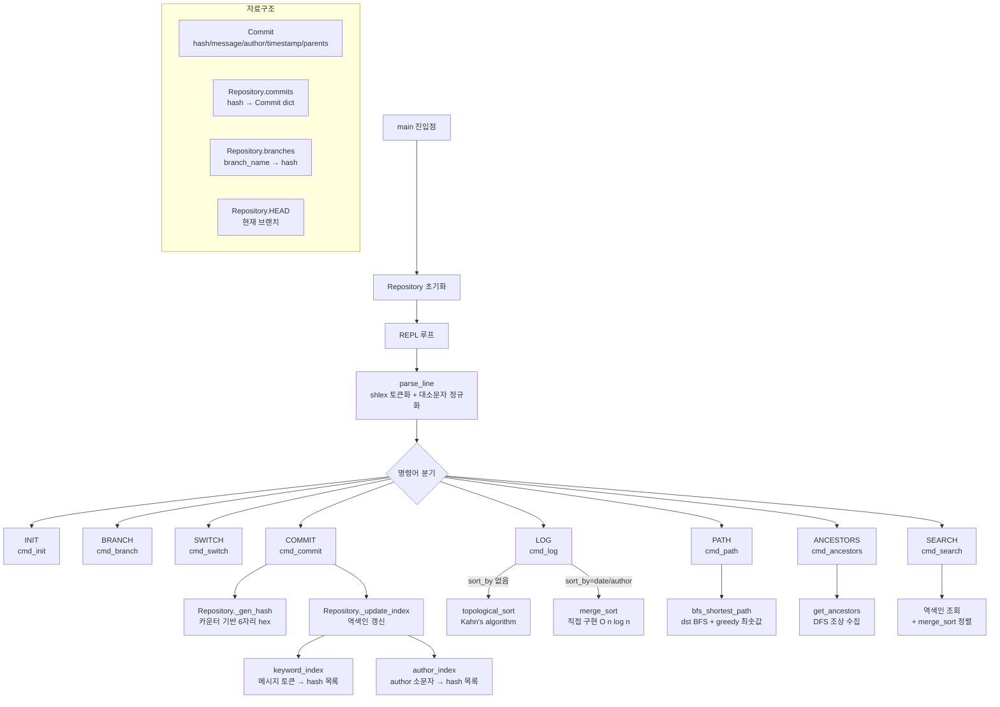

# 구조도

```mermaid
flowchart TD
    A[main 진입점] --> B[Repository 초기화]
    B --> C[REPL 루프]
    C --> D[parse_line\nshlex 토큰화 + 대소문자 정규화]
    D --> E{명령어 분기}

    E --> F[INIT\ncmd_init]
    E --> G[BRANCH\ncmd_branch]
    E --> H[SWITCH\ncmd_switch]
    E --> I[COMMIT\ncmd_commit]
    E --> J[LOG\ncmd_log]
    E --> K[PATH\ncmd_path]
    E --> L[ANCESTORS\ncmd_ancestors]
    E --> M[SEARCH\ncmd_search]

    I --> N[Repository._gen_hash\n카운터 기반 6자리 hex]
    I --> O[Repository._update_index\n역색인 갱신]
    O --> O1[keyword_index\n메시지 토큰 → hash 목록]
    O --> O2[author_index\nauthor 소문자 → hash 목록]

    J -->|sort_by 없음| P[topological_sort\nKahn's algorithm]
    J -->|sort_by=date/author| Q[merge_sort\n직접 구현 O n log n]

    K --> R[bfs_shortest_path\ndst BFS + greedy 최솟값]
    L --> S[get_ancestors\nDFS 조상 수집]
    M --> T[역색인 조회\n+ merge_sort 정렬]

    subgraph 자료구조
        U[Commit\nhash/message/author/timestamp/parents]
        V[Repository.commits\nhash → Commit dict]
        W[Repository.branches\nbranch_name → hash]
        X[Repository.HEAD\n현재 브랜치]
    end
```
