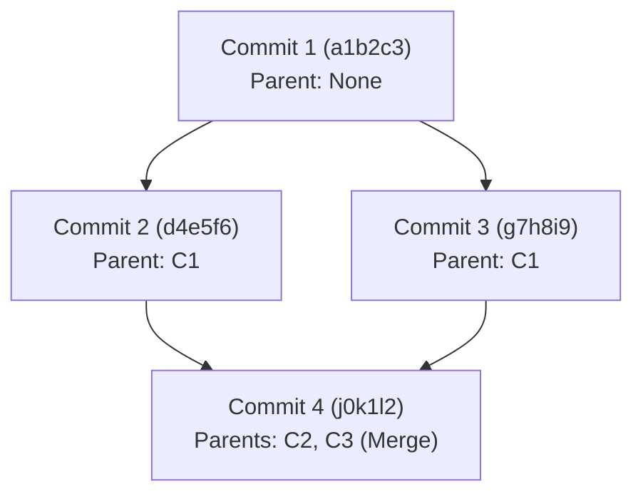

# Software Requirements Specification (SRS) for Mini Git

---

## 1. 소개 (Introduction)

### 1.1 목적 (Purpose)
본 문서는 CLI 기반 버전 관리 시뮬레이터인 **Mini Git**의 시스템 요구사항을 정의합니다. 본 프로젝트는 Git의 핵심 자료구조인 Directed Acyclic Graph(DAG)와 해시(Hash), 그리고 역색인(Inverted Index), 위상 정렬(Topological Sort), 최단 경로 탐색 등의 알고리즘을 직접 구현하고 체득하는 것을 목적으로 합니다.

### 1.2 시스템 범위 (Scope)
Mini Git은 실제 Git의 동작 메커니즘을 단순화하여 메모리 상에서 시뮬레이션하는 CLI 애플리케이션입니다. 실제 파일의 생성 및 변경 이력을 트래킹하는 대신, 커밋 메타데이터 중심의 그래프 구조를 생성하고, 브랜치 관리, 커밋 검색 및 정렬, 최단 경로 탐색 기능을 제공합니다.

---

## 2. 전체 설명 (Overall Description)

### 2.1 시스템 환경 및 제약 사항
- **개발 및 실행 환경**: Python 3.10 이상
- **라이브러리 제한**:
  - 그래프 전용 외부 라이브러리(예: `NetworkX` 등) 사용 금지
  - Python 내장 정렬 API(`sorted()`, `list.sort()`) 사용 금지 (직접 정렬 알고리즘 구현 필요)
  - 기본 자료형(`list`, `dict`, `set`) 및 문자열 처리, 파일 I/O, 시간 처리(`datetime`, `time`) 라이브러리는 사용 가능
- **기능적 제한**:
  - 파일 내용 추적(물리적 파일 버전 관리)은 구현하지 않음 (커밋 메타데이터 중심 동작)
  - 네트워크 통신(원격 저장소 동기화 등) 기능은 제외
  - 데이터 영속성(물리 디스크 저장)은 필수가 아니며, 메모리 상 동작으로 충분함

### 2.2 사용자 인터페이스 (REPL)
- 애플리케이션은 터미널에서 실행되며, `mini-git>` 프롬프트를 통해 사용자 입력을 지속적으로 받아 파싱, 실행, 결과 출력을 반복하는 REPL(Read-Eval-Print Loop) 형태로 동작합니다.
- `exit` 또는 `quit` 명령어 입력 시 프로그램이 정상 종료됩니다.

---

## 3. 자료구조 설계 요구사항 (Data Structure Requirements)

Mini Git의 핵심 기능을 지원하기 위해 다음의 세 가지 자료구조를 내부적으로 구현하고 관리해야 합니다.

### 3.1 커밋 노드 (Commit Node)
각 커밋은 아래의 필드를 반드시 포함하는 독립된 객체(또는 딕셔너리)로 정의됩니다.

| 필드명 | 데이터 타입 | 설명 |
| :--- | :--- | :--- |
| `hash` | String | 세션 내 유일성이 보장되는 커밋 식별자 (난수, 해시 함수, 또는 순차적 카운터 기반) |
| `message` | String | 사용자가 입력한 커밋 메시지 |
| `author` | String | 커밋 작성자 이름 |
| `timestamp` | Float / Datetime | 커밋이 생성된 시각 |
| `parents` | List of String / Commit | 부모 커밋 객체 또는 부모 커밋 해시의 리스트 (0개 이상) |

### 3.2 커밋 그래프 (Commit Graph - DAG)
- **DAG (Directed Acyclic Graph)**: 커밋 간의 부모-자식 관계는 방향성이 있고 사이클이 없는 그래프 구조를 형성해야 합니다.
- **저장 방식**: 특정 커밋 해시로 커밋 객체를 $O(1)$ 시간 내에 조회할 수 있도록 해시맵(Python의 `dict`) 기반으로 커밋 저장소를 관리합니다.



### 3.3 역색인 (Inverted Index)
검색 성능 최적화를 위해 모든 커밋 노드를 선형 순회(Linear Search)하지 않고 $O(1)$ 또는 $O(k)$에 후보 커밋을 조회할 수 있도록 두 가지 역색인을 구성합니다.
1. **키워드 인덱스 (Keyword Index)**: 
   - **키(Key)**: 커밋 메시지를 공백 단위로 분리(split)하고 소문자(lower)로 정규화한 개별 단어 토큰
   - **값(Value)**: 해당 단어가 포함된 커밋 해시들의 리스트/셋
2. **작성자 인덱스 (Author Index)**:
   - **키(Key)**: 작성자 이름 (소문자 정규화 적용 권장)
   - **값(Value)**: 해당 작성자가 생성한 커밋 해시들의 리스트/셋

---

## 4. 기능적 요구사항 (Functional Requirements)

### 4.1 CLI 공통 입력 규칙
- **대소문자 미구분**: 명령어(예: `INIT`, `BRANCH` 등)는 대소문자를 구분하지 않고 정상 처리해야 합니다.
- **공백 포함 문자열 처리**: 작성자 이름, 커밋 메시지, 검색 키워드에 공백이 포함되는 경우 반드시 큰따옴표(`"`) 또는 작은따옴표(`'`)로 감싸서 입력합니다.
- **표준 에러 메시지**: 예외 상황 발생 시 프로그램이 강제 종료되지 않고 지정된 에러 메시지를 출력해야 합니다.
  - 인자 불일치: `Invalid args`
  - 존재하지 않는 브랜치 접근: `Unknown branch: <name>`
  - 존재하지 않는 커밋 해시 접근: `Unknown commit: <hash>`

---

### 4.2 상세 명령어 요구사항

#### (1) INIT `<user_name>`
- **설명**: Mini Git 저장소를 초기화합니다.
- **처리 흐름**:
  1. 기본 브랜치인 `main` 브랜치를 생성하고 HEAD로 설정합니다.
  2. 현재 작업 세션의 기본 작성자(author)를 `<user_name>`으로 지정합니다.
- **예시 출력**:
  ```text
  Initialized repository.
  Current branch: main
  Current user: Alice
  ```

#### (2) BRANCH `<branch_name>`
- **설명**: 현재 HEAD가 가리키고 있는 커밋을 가리키는 새로운 브랜치 포인터를 생성합니다.
- **처리 흐름**:
  1. 현재 HEAD 위치에 지명된 `<branch_name>`의 브랜치를 등록합니다.
  2. 만약 아직 커밋이 하나도 존재하지 않는 경우의 예외 처리를 정의해야 합니다.
- **예시 출력**:
  ```text
  Created branch: feature
  ```

#### (3) SWITCH `<branch_name>`
- **설명**: HEAD 포인터를 지정한 브랜치로 이동시킵니다.
- **처리 흐름**:
  1. `<branch_name>`이 가리키는 커밋으로 HEAD를 전환합니다.
  2. 존재하지 않는 브랜치명을 입력한 경우 `Unknown branch: <branch_name>` 에러를 출력합니다.
- **예시 출력**:
  ```text
  Switched to branch: feature
  ```

#### (4) COMMIT `<message>`
- **설명**: 현재 HEAD 커밋을 부모로 두고, 현재 사용자를 작성자로 하는 새로운 커밋 노드를 생성합니다.
- **처리 흐름**:
  1. 고유한 커밋 해시를 생성합니다 (중복이 발생하지 않는 방식).
  2. 현재 HEAD가 가리키는 커밋을 부모 목록(`parents`)에 추가합니다. (최초 커밋인 경우 부모는 없음)
  3. HEAD 포인터 및 현재 브랜치 포인터를 새로 생성된 커밋으로 갱신합니다.
  4. 신규 커밋 메시지를 토큰화하여 **역색인(Keyword Index, Author Index)**을 실시간으로 갱신합니다.
- **예시 출력**:
  ```text
  [feature d4e5f6] Add login feature
  ```

#### (5) LOG
- **설명**: 저장소의 모든 커밋 히스토리를 출력합니다.
- **처리 흐름**:
  - 일반적인 최신순 정렬이 아닌, **부모 커밋이 항상 자식 커밋보다 먼저 출력되는 위상 정렬(Topological Sort) 순서**로 출력해야 합니다.
  - 출력 시 각 커밋의 `hash`, `author`, `timestamp`, `message` 및 해당 커밋을 가리키는 브랜치 정보를 시각적으로 구분할 수 있어야 합니다.

#### (6) LOG `--sort-by=date|author`
- **설명**: 직접 구현한 정렬 알고리즘을 적용하여 지정된 기준으로 정렬된 로그를 출력합니다.
- **옵션 값**:
  - `date`: 커밋 생성 시간(`timestamp`) 기준 정렬 (동률 처리 규칙은 개발자 정의)
  - `author`: 작성자 이름(`author`) 기준 사전순 정렬
- **제약**: 내장 정렬 함수인 `sorted()`, `list.sort()`의 사용을 엄격히 금지합니다.

#### (7) PATH `<commit1> <commit2>`
- **설명**: 두 커밋 사이의 최단 경로를 탐색하여 출력합니다.
- **처리 흐름**:
  1. 커밋과 부모의 방향성 관계를 무시하고 **무방향 간선(Undirected Edge)**으로 간주합니다.
  2. 두 노드 간의 최단 경로(최소 간선 수)를 탐색합니다.
  3. 만약 경로가 존재하지 않는 경우 `No path`를 출력합니다.
  4. **사전순 최소 경로 선택**: 만약 동일한 최단 길이를 가지는 경로가 여러 개 존재할 경우, 경로를 `hash1->hash2->...` 문자열로 표현했을 때 사전순(Lexicographical)으로 가장 빠른 경로를 선택합니다.
- **예시 출력**:
  ```text
  Path: a1b2c3 -> g7h8i9
  ```

#### (8) ANCESTORS `<commit_hash>`
- **설명**: 입력받은 특정 커밋으로부터 도달 가능한 모든 조상(Ancestor) 커밋 목록을 중복 없이 탐색하여 출력합니다.
- **처리 흐름**:
  1. `<commit_hash>`에서 출발하여 부모 방향 링크를 따라 그래프를 탐색합니다.
  2. 도달 가능한 모든 커밋 노드를 수집하여 리스트로 출력합니다.
  3. 존재하지 않는 커밋 해시일 경우 `Unknown commit: <commit_hash>` 에러를 출력합니다.

#### (9) SEARCH `<keyword>`
- **설명**: 입력된 단어 토큰이 포함된 커밋들을 **역색인(Keyword Index)**을 활용해 실시간으로 검색하여 출력합니다.
- **처리 흐름**:
  1. 키워드를 소문자로 변환한 뒤 Keyword Index에서 매칭되는 커밋 해시 리스트를 $O(1)$ 시간 내에 직접 조회합니다. (전체 커밋 노드 순회 금지)
  2. 해당 커밋들의 정보를 포맷에 맞춰 출력합니다.

#### (10) SEARCH `--author=<name>`
- **설명**: 지정된 작성자가 작성한 모든 커밋들을 **역색인(Author Index)**을 활용해 검색하여 출력합니다.
- **처리 흐름**:
  1. Author Index에서 `<name>`에 매칭되는 커밋 해시 리스트를 직접 조회합니다.
  2. 해당 커밋들의 정보를 포맷에 맞춰 출력합니다.

---

## 5. 비기능적 요구사항 (Non-Functional Requirements)

- **안정성 (Reliability)**: 잘못된 파라미터나 예외 값이 입력되었을 때 에러 메시지를 출력하되, REPL 세션이 중단되거나 비정상 종료되어서는 안 됩니다.
- **유일성 (Uniqueness)**: 임의의 알고리즘(카운터, 난수 해싱 등)을 사용하여 커밋 해시 생성 시 세션 내에서 중복이 절대 발생하지 않도록 설계해야 합니다.
- **모듈화 (Modularity)**: 
  - 그래프 탐색 로직(BFS, DFS, 최단 경로), 정렬 알고리즘(Quick Sort, Merge Sort 등), 역색인 구조 관리 로직은 독립된 클래스 또는 모듈로 명확히 분리합니다.
  - 모든 모듈과 주요 함수에는 Docstring 및 상세 주석을 작성하여 유지보수성을 높여야 합니다.

---

## 6. 보너스 요구사항 (선택 기능)

### 6.1 줄 단위 비교 도구 (Diff)
- **명령어**: `diff <file1> <file2>`
- **설명**: 두 텍스트 파일의 경로를 인자로 받아 줄(Line) 단위로 비교 분석합니다.
- **출력**: 각 줄에 대해 추가(`+`), 삭제(`-`), 공통(공백) 상태를 직관적으로 구분하여 출력합니다.

### 6.2 브랜치 병합 (Merge)
- **명령어**: `merge <branch_name>`
- **설명**: 현재 브랜치(HEAD)와 대상 브랜치의 최신 커밋을 병합합니다.
- **처리 흐름**:
  - 부모 커밋을 2개(`현재 HEAD`, `대상 브랜치 HEAD`) 가지는 새로운 Merge Commit을 생성합니다.

### 6.3 정렬 알고리즘 성능 벤치마크
- **설명**: 임의의 커밋 리스트(크기 $N$ 변경 가능)를 생성하여, 서로 다른 직접 구현한 정렬 알고리즘 2종 이상(예: Bubble Sort vs Quick Sort)의 실제 정렬 시간을 측정하고 비교 분석합니다.

---

## 7. 인수 테스트 시나리오 (Acceptance Criteria)

구현된 Mini Git 프로그램은 최소한 다음 시나리오를 충족해야 합격으로 판단합니다.

```text
1. INIT "Alice"
   -> 저장소 초기화, main 브랜치 활성화, 사용자 Alice 확인
2. COMMIT "Initial commit"
   -> 해시(예: a1b2c3)와 함께 커밋 성공
3. BRANCH feature
   -> feature 브랜치 생성 완료
4. SWITCH feature
   -> feature 브랜치로 전환 완료
5. COMMIT "Add login feature"
   -> feature 브랜치에 신규 커밋(예: d4e5f6) 생성 및 역색인 반영
6. SEARCH "login"
   -> d4e5f6 커밋이 검색 목록에 노출되는지 확인
7. SWITCH main
   -> main 브랜치로 전환 완료
8. COMMIT "Add payment feature"
   -> main 브랜치에 신규 커밋(예: g7h8i9) 생성 및 역색인 반영
9. LOG
   -> a1b2c3 -> d4e5f6 -> g7h8i9 또는 위상 정렬 규칙에 부합하는 형태로 로그 출력되는지 검증
10. PATH a1b2c3 g7h8i9
    -> 최단 경로 탐색 결과 확인
```
